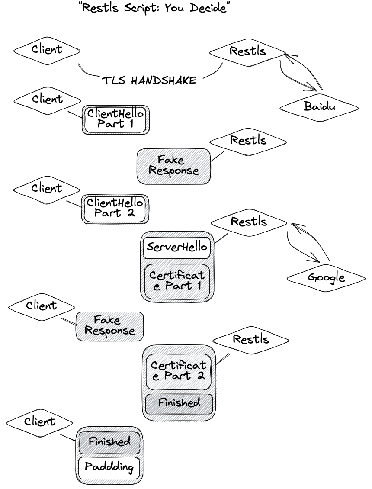

# Restls

A protocol that can disguise your proxy traffic as regular TLS traffic:

* Disguise your proxy server [as any TLS server](./Restls%3A%20A%20Perfect%20Impersonation%20of%20TLS.md), such as `microsoft.com`.
* Developed based on [utls](https://github.com/refraction-networking/utls), Disguise your [proxy client](https://github.com/3andne/Clash.Meta#restls) as a normal browser.
* Use the `Restls-Script` protocol to conceal your proxy behavior and break characteristics such as "TLS in TLS".

---

一个可以把你的代理流量伪装成普通TLS流量的协议：

* 把你的代理服务器[伪装成任何一个TLS服务器](./Restls%3A%20%E5%AF%B9TLS%E7%9A%84%E5%AE%8C%E7%BE%8E%E4%BC%AA%E8%A3%85.md)，例如`microsoft.com`。
* 基于[utls](https://github.com/refraction-networking/utls)开发，把你的[代理客户端](https://github.com/3andne/Clash.Meta#restls)伪装成一个普通的浏览器。
* 使用Restls「剧本」协议，隐藏你的代理行为，破坏"TLS in TLS"等特征。

## Hide Your Proxy Traffic Behavior

"TLS in TLS" and other proxy-specific traffic behaviors can be used to identify TLS-based protocols. A typical "TLS in TLS" connection is shown in the following diagram:  

"TLS in TLS"等代理特有流量行为可以被用来识别基于TLS的协议，一个典型的"TLS in TLS"连接如图所示：


Restls disrupts these obvious proxy behavior characteristics through the use of "restls-scripts". The following diagram shows Restls traffic disguised using `restls-scripts`:  

Restls通过「剧本」机制来破坏这些明显的代理行为特征，下图为使用「剧本」伪装后的Restls流量：



If you want to learn more about how `restls-scripts` work and how to design your own, please refer to: [Restls-Script: Hide Your Proxy Traffic Behavior](./Restls-Script:%20Hide%20Your%20Proxy%20Traffic%20Behavior.md)  

如果你想了解更多关于「剧本」是如何运作的，以及如何设计自己的「剧本」，请参考：[Restls-Script: 隐藏你的代理行为](./Restls-Script:%20隐藏你的代理行为.md)

## Usage

To build it from source:

```
cargo build --release
```

Basic usage:
```
USAGE:
    restls --forward-to <forward-to> --listen <listen> --log-level <log-level> --password <password> --server-hostname <server-hostname> --script <script>
```


To deploy a Restls Service:
1. Start the shadowsocks server:
    ```
    ss-server -s 127.0.0.1 -p 8888 -k [YOUR_SS_PASSWORD]
    ```
2. Start the Restls server:
   To parrot a TLS 1.3 server:
   ```
   restls -s "www.microsoft.com" -l "0.0.0.0:443" -p [YOUR_RESTLS_PASSWORD] -f "127.0.0.1:8888" --script "200?100,400?100,1200?200<1,1100~300,1000~100<1,2500~500,1300~50,1300~50,100~1200"
   ```
   Or to parrot a TLS 1.2 server:
   ```
   restls -s "vscode.dev" -l "0.0.0.0:443" -p [YOUR_RESTLS_PASSWORD] -f "127.0.0.1:8888" --script "200?100,400?100,1200?200<1,1100~300,1000~100<1,2500~500,1300~50,1300~50,100~1200"
   ```
3. Define a restls proxy in [Clash.Meta Restls fork](https://github.com/3andne/Clash.Meta#restls)
   ```
   - name: restls-tls13
     type: ss
     server: [YOUR_SERVER_IP]
     port: 443
     cipher: chacha20-ietf-poly1305
     password: [YOUR_SS_PASSWORD]
     plugin: restls
     plugin-opts:
         host: "www.microsoft.com" # Must be a TLS 1.3 server
         password: [YOUR_RESTLS_PASSWORD]
         version-hint: "tls13"
         client-id: chrome # One of: chrome, ios, firefox or safari
   - name: restls-tls12
     type: ss
     server: [YOUR_SERVER_IP]
     port: 443
     cipher: chacha20-ietf-poly1305
     password: [YOUR_SS_PASSWORD]
     plugin: restls
     plugin-opts:
         host: "vscode.dev" # Must be a TLS 1.2 server
         password: [YOUR_RESTLS_PASSWORD]
         version-hint: "tls12"
         curve-id-hint: "curvep384" # One of: x25519, curvep384, curvep521 or curvep256
                                    # If you have no idea, just choose a random one.
                                    # If that's incorrect, your first connection will fail.
                                    # But the client will correct that for you.
         client-id: firefox # One of: chrome, ios, firefox or safari
   ```