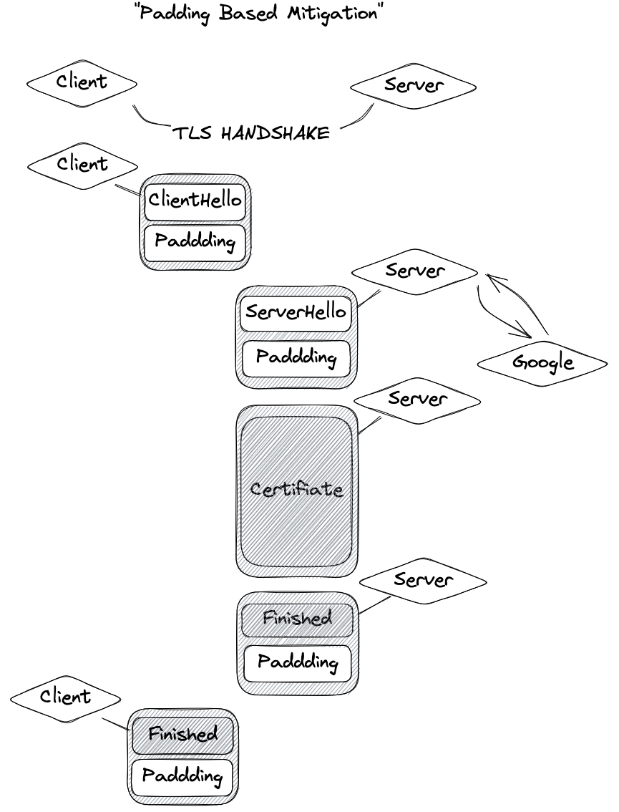

# Restls-Script: Hide Your Proxy Traffic Behavior

`Authored by: 3andne`

## Introduction

It is speculated that the large-scale ban on TLS-related proxy protocols at the end of 2022 is targeting several features of the current protocol:

1. Using cheap or free domains and using free certificates issued by let's encrypt.
2. The TLS `ClientHello` fingerprint of proxy tool clients is significantly different from that of regular browsers.
3. Behavioral characteristics generated after the TLS channel is established. One well-known characteristic is "TLS in TLS."

Restls has already solved the problem of TLS server impersonation, and the [Restls client](https://github.com/3andne/restls-client-go) has addressed the issue of client fingerprints by forking [utls](https://github.com/refraction-networking/utls). The last remaining issue has become pressing: **how will Restls withstand passive traffic analysis?**

In `Restls-V1`, our answer to this challenge is the `Restls-Script`.

## Proxy Behavioral Characteristics and "TLS in TLS"

Although various proxy protocols can provide a certain degree of encryption and integrity protection to prevent attackers from identifying proxy servers based on the content of data packets, this cannot prevent proxy behavior from being exposed through side channels. Taking "TLS in TLS" as an example, the following figure shows the difference between "TLS in TLS" traffic and ordinary HTTPS traffic:

The clientHello generated by the browser (i.e., the first packet sent by the client) is about 500 bytes. The server responds with a packet containing the certificate and other handshake data packets, which range in length from 2000 to 7000 bytes. Next, the client sends a packet of about 100 bytes. If it is a TLS 1.2 full-handshake, the server will also reply with a packet of about 100 bytes. While these packets are encrypted, the majority of them have a predictable length. Although the length of the server certificate is uncertain, they are generally very long. Different proxy protocols can add predictable lengths to the packets during this process, making it possible to identify specific protocols. For example, this technique might be used to distinguish between Trojan and VMess + WSS protocols.

## Existing Solutions

The community has made some attempts to address this issue, with padding being the most representative approach. It's been used in [naiveproxy](https://github.com/klzgrad/naiveproxy) and [shadowsocks-2022](https://github.com/Shadowsocks-NET/shadowsocks-specs/blob/main/2022-1-shadowsocks-2022-edition.md). The following diagram illustrates a feasible padding approach.

However, as summarized by naiveproxy, the use of padding still provides possible characteristics for traffic analysis. In summary:

1. Padding does not fundamentally change the behavior pattern of the TLS handshake, which involves the client sending a short packet -> the server replying with one to four packets, the first or second packet is abnormally long -> the client sending another short packet -> the server replying with a short packet.
2. Padding can only increase the length of the packets, and current protocols lack the ability to split long packets into short ones.
3. On the other hand, proxy protocols often provide a unified padding strategy in their implementation, which may result in a protocol fingerprint.

## Restls-Script: You're in Charge

To address this issue, Restls has designed a mechanism called "script" that allows highly customizable post-handshake traffic behavior. The following diagram illustrates the capabilities of the `Restls-Script`:

`Restls-Script` has the following capabilities:

1. Specify the length of the nth packet; if the data to be sent exceeds the length specified in the script, the data will be truncated; if the data to be sent is less than the length specified in the script, padding will be added.
2. Request the peer to send `m` responses after the peer receiving a certain packet.

With these two capabilities, we can control the length and traffic pattern of Restls in the inner TLS handshake phase in an extremely flexible manner, **thereby completely disrupting the "TLS in TLS" and other characteristics**.  
**Each user can write their own script, making Restls have no unified characteristics and greatly reducing the threat of passive traffic analysis.**

## Syntax

Here we provide an example of how to write a "script".
Take "200?10,300~50,70<2,100~1000<1" as an example. This script determines the behavior of the first four user data packets in Restls:

1. The length of the first data packet will be between 200 and 210, and this length will be determined at startup (assuming it is 203). The length of the first packet for each subsequent connection will also be 203.
2. The length of the second data packet will be between 300 and 350, and unlike the first packet, this length will be randomly determined for each connection.
3. The length of the third packet is fixed at 70, and Restls requires the peer to send two response records (`<2`).
4. The length of the fourth packet will be between 100 and 1100, and will be different for each connection. Restls requires the other party to send one response record (`<1`).

## Limitations

Despite providing stronger disguise capabilities, the "script" also has some limitations:

1. The "fake response" mechanism will increase the number of round-trips during the inner tls handshake phase. Although it is not currently a targetable feature, the delay will be increased. This is a trade-off between stealthiness and user experience.
2. Currently, the "script" is designed as a mechanism for the first few packets. Although you can write a long script, we do not provide syntax that covers all subsequent traffic. Disguising subsequent traffic patterns is theoretically more difficult. For example, a connection to video websites may have highly uneven uploads and downloads. No matter how it is disguised, the fact that a large amount of data needs to be transmitted cannot be hidden.