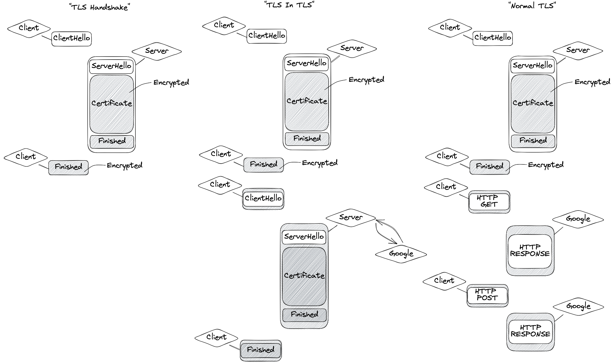
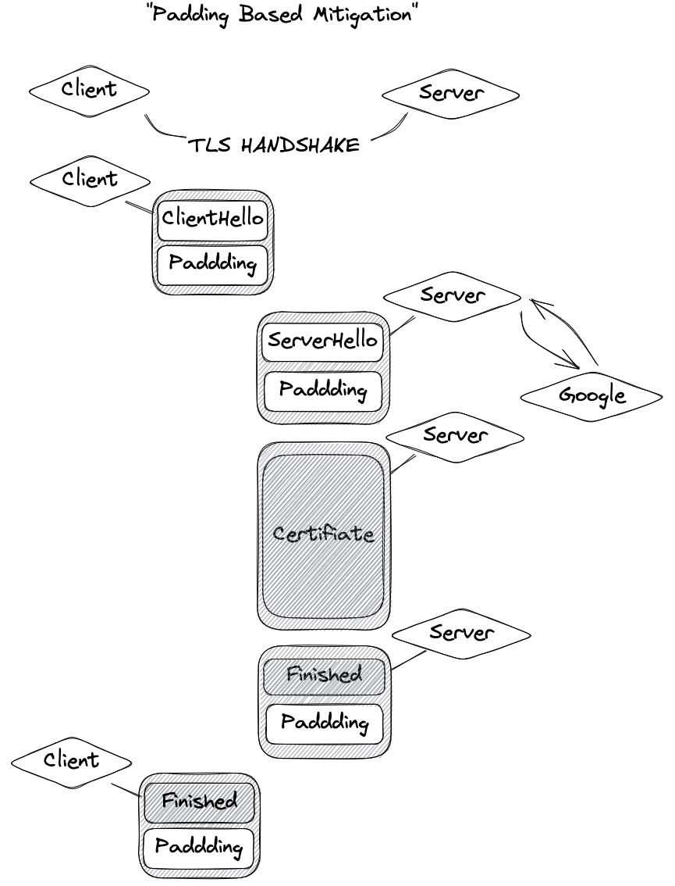
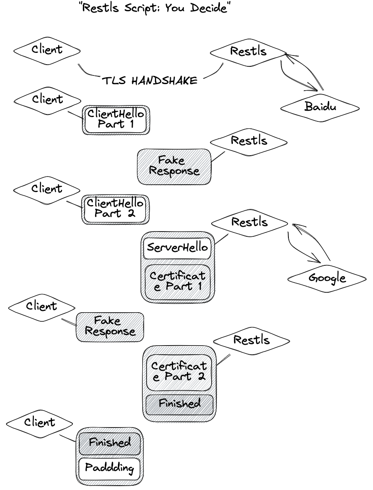

# Restls-Script: 隐藏你的代理行为

`作者: 3andne`

## 引言

根据推测，2022年末的一系列针对TLS相关代理协议的大规模封杀针对的是当前协议的几个特征：
1. 使用小众域名、廉价证书
2. 代理工具客户端与普通浏览器截然不同的TLS ClientHello指纹
3. 在TLS通道建立后，客户端与目标网站的连接所产生的代理行为特征。其中比较为人所知的一种特征是就是"TLS in TLS"。

Restls已经解决了TLS服务端伪装问题，[Restls客户端](https://github.com/3andne/restls-client-go)又通过基于[utls](https://github.com/refraction-networking/utls)二次开发的方式解决了客户端指纹问题，剩下的最后一个问题变得迫在眉睫：**Restls将如何抵御被动流量分析？**

在Restls-V1中，我们对该挑战的答案是Restls剧本(Restls-Script)。

## 代理行为特征与"TLS in TLS"

尽管各类代理协议都能提供一定程度的加密及完整性保护，让攻击者无法通过数据包的内容判断识别代理服务器，但这无法阻止代理的行为通过侧信道暴露，以"TLS in TLS"为例，下图展示了"TLS in TLS"流量与普通HTTPS流量的区别：  

浏览器所产生的clientHello（即客户端发送的第一个数据包）约为500 Byte。服务器会回复一个包含Certificate、长度在2000-7000 Byte的数据包（ServerHello等其他握手数据包往往一同到达）。接下来，客户端发送一个100 Byte左右的数据包。如果是TLS 1.2的完整握手，服务器还会回复一个100 Byte左右的包。  
尽管这些包都被加密过，但TLS握手中大部分包的长度都是基本固定的。虽然服务器Certificate的长度并不确定，但它们普遍超长。不同的代理协议会给这个过程的包增加可以预测的长度，使得"TLS in TLS"可能识别到具体的协议（例如区分Trojan 和 VMess + WSS）。

## 现存解决方案

社区针对这个问题有过一些尝试，以在[naiveproxy](https://github.com/klzgrad/naiveproxy)中使用的padding最具有代表性，下图是一种可行的加padding的思路。

然而，就如同[naiveproxy](https://github.com/klzgrad/naiveproxy#known-weaknesses)所总结的，使用padding仍然为流量分析提供了可能的特征。总结下来：
1. padding在根本上没有改变TLS握手的行为模式，即客户端发送一个较短包 -> 服务端回复一个到四个包，其中第一个或第二个异常地长 -> 客户端发送一个较短包 -> 服务端回复一个较短包。
2. padding往往只能增加包的长度，现存协议缺乏把长包拆分成短包的能力。
3. 另外一方面，代理协议在实现中往往提供了统一的padding策略，可能形成统一的协议指纹。

## Restls「剧本」：你说了算

为此，Restls设计了一个可以高度定制化握手后流量行为的机制，我们称之为「剧本」，下图简单展示Restls剧本的能力：

Restls剧本具有以下能力：
1. 指定第n个包的长度；如果要发送的数据超过了剧本给定的长度，数据会被截断；如果要发送的数据低于剧本给定的长度，数据会被添加padding
2. 要求对方在收到某个包之后，向自己发送m个response。

**在这两种能力的帮助下，我们可以极其灵活地控制Restls在内层TLS握手阶段的长度及收发模式，从而彻底破坏"TLS in TLS"等特征**。  
**每个用户都可以根据喜好设置自己的剧本，使得Restls不存在统一的特征，极大降低被动流量分析的威胁。**

### 语法

我们举例说明如何撰写「剧本」。  
以`"200?10,300~50,70<2,100~1000<1"`为例，该剧本决定了Restls前4个用户数据包的行为：
1. 第一个数据包的长度会在200-210之间，该长度会在启动时确定（假定是203），之后的每次连接的第一个包的长度都会是203。
2. 第二个数据包的长度在300-350之间，与第一个包不同，该长度在每次连接都会随机确定。
3. 第三个包的长度固定为70，同时restls要求对方向自己发送两个回包(`<2`)。
4. 第四个包的长度在100-1100之间且每次连接都会不同，对方需要发送一个回包(`<1`)。

### 局限

尽管「剧本」提供了更强的伪装能力，但也有一些限制：
1. `fake response`机制会增加握手阶段的往返次数。尽管它暂时不太可能成为一个可以被针对的特征，但延迟会明显增加。这是一个隐蔽性和用户体验之间的取舍。
2. 目前「剧本」被设计为针对前几个包的机制。虽然你可以把剧本写得很长，但我们并没有提供一个覆盖后续所有流量的语法。后续流量模式的伪装在理论上比较困难。例如，一个视频类的连接的上传和下载极不均衡。无论怎样伪装，都无法隐藏需要传输大量数据的事实。